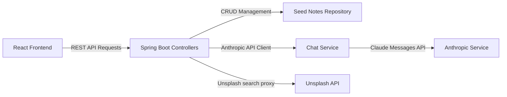

# AI Study Buddy 📚🤖

An interactive, premium, AI-powered learning dashboard that allows students to organize study notes, attach illustrated visual aids, dictate summaries using speech-to-text, and chat with a customizable AI tutor. 

Built with a **Spring Boot** backend and a **Vite + React** frontend.

---

## 🚀 Key Features

### 1. 📝 Topics Library & Note Editor
- Organize study notes with a clean, grid-based interface.
- Dedicates 70% width to note content and list views for comfortable reading.
- **Micro-Thumbnails**: Notes list automatically displays a tiny, rounded-corner image preview next to note titles.

### 2. 🎨 Three-Way Image Attachment System
Attach visual illustrations to your study notes using three separate editor tabs:
- **Paste URL (Default)**: Enter any public image URL and view a live preview rendered instantly below the text input.
- **Draw**: Use a built-in HTML5 Canvas sketchpad to hand-draw diagrams. Includes:
  - Pen tool with a color picker.
  - Smart Eraser tool.
  - Brush size slider (2px to 30px).
  - Canvas Clear button.
  - Automatic drawing state restoration (loads existing sketches when editing a note).
- **Search (Unsplash)**: Query Unsplash for educational stock photos using a proxy search box.
  - Automatically URL-encodes special characters and spaces.
  - Displays exactly 8 selectable result thumbnails in a responsive grid.

### 3. 🎙️ Voice Dictation (Speech-to-Text)
- Record your voice to dictate study notes directly into the editor.
- Leverage the browser's Web Speech API (`webkitSpeechRecognition`) for hands-free typing.

### 4. 🤖 AI Chat Assistant (with Strict Notes Mode)
- A floating chat assistant widget located in the bottom-right corner.
- **Strict Notes Mode (ON)**: Enforces strict constraint rules. The AI answers queries using **ONLY** facts from your Notes Library. If information is missing, it refuses with: *"I can only help you with study-related questions from your notes"*.
- **Strict Notes Mode (OFF)**: Behaves like a general-purpose ChatGPT assistant. AI uses its general knowledge database, treating your study notes as optional reference context.
- Includes a **🖼️ Explain Image** suggestion chip to trigger instant visual analysis.

---

## 🛠️ System Architecture



---

## ⚙️ Configuration & Environment Variables

The backend dynamically checks for API configuration keys. If no keys are set, it **automatically runs in Mock Demo Mode** (returning mock visual analysis comments and mock study stock photos).

To enable full capabilities:
- **`ANTHROPIC_API_KEY`**: Your Claude API key.
- **`UNSPLASH_API_KEY`**: Your Unsplash developer access token.

---

## 📦 Installation & Getting Started

### Prerequisites
- **Java Development Kit (JDK)**: Version 17 or higher
- **Maven**: Version 3.8+
- **Node.js**: Version 18+ and **npm**

### Step 1: Clone and Prepare
```bash
git clone https://github.com/madhulasya/AI-Study-Buddy.git
cd AI-Study-Buddy
```

### Step 2: Start the Spring Boot Backend
Configure your environment variables and start the server:
```bash
cd backend

# Option A: Run in Mock Demo Mode (Default)
mvn spring-boot:run

# Option B: Run with active API credentials (macOS / Linux)
export ANTHROPIC_API_KEY="your_claude_key"
export UNSPLASH_API_KEY="your_unsplash_access_key"
mvn spring-boot:run
```
The backend server will launch on port **8080** (`http://localhost:8080`).

### Step 3: Start the Vite + React Frontend
In a new terminal window:
```bash
cd frontend
npm install
npm run dev
```
Open [http://localhost:3000](http://localhost:3000) in your web browser.

---

## 📊 API Endpoint Documentation

### 📝 Notes CRUD
- **`GET /api/notes`**: Retrieve all study notes.
- **`POST /api/notes`**: Create a new study note.
  - Body: `{ "topic": "string", "content": "string", "image": "string" }`
- **`PUT /api/notes/{id}`**: Update an existing study note.
- **`DELETE /api/notes/{id}`**: Delete a study note.

### 🤖 Chat & Assistant
- **`POST /api/chat`**: Send a message to the AI Study Buddy.
  - Body: `{ "question": "string", "strictMode": boolean, "image": "string" }`

### 🔍 Proxy Search
- **`GET /api/images/search?query=...`**: Search for Unsplash illustrations.
  - Automatically logs the outbound request to stdout:
    `Sending Unsplash search request URL: https://api.unsplash.com/search/photos?query=Newtonian%20Physics&per_page=8`
  - Returns exactly 8 image URLs.
